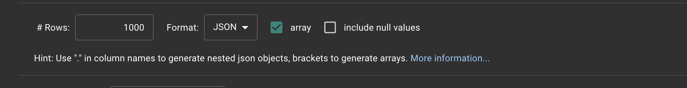

# mockaroo-to-rockset.py
A simple Python example using Rockset's REST APIs to publish records from Mockaroo's REST APIs. It is an easy way to generate test data into Rockset once you have a defined schema in Mockaroo.

## Dependencies
1. Python 3 (tested on Python 3.9.9)
2. [requests](https://docs.python-requests.org/en/latest/)
3. [Mockaroo](https://mockaroo.com/) account (free tier is fine)
4. Two environment variables need to be set.
```
export ROCKSET_APIKEY=<your Rockset api key>
export ROCKSET_APISERVER=<your regional Rockset api> (example format is "https://api.rs2.usw2.rockset.com")
```

## Important
Make sure the settings on your Mockaroo schema are set to **JSON** format and **array** is checked. It should look like this:



## Examples
This will display the help context.

```
python mockaroo-to-rockset.py -h
```

This will publish 10 records to the collection "patrick_collection" one time in the default workspace (commons).

```
python mockaroo-to-rockset.py \
    -c patrick_collection \
    -i 1 \
    "https://api.mockaroo.com/api/50c182d0?count=10&key=<your_mockaroo_key>"
```

Similar example but with an explicity workspace parameter for "test_workspace".

```
python mockaroo-to-rockset.py \
    -c patrick_collection \
    -w test_workspace \
    "https://api.mockaroo.com/api/50c182d0?count=10&key=<your_mockaroo_key>"
``` 

## References
- https://rockset.com/docs/rest-api/
- https://docs.python-requests.org/en/latest/
- https://github.com/pyenv/pyenv
